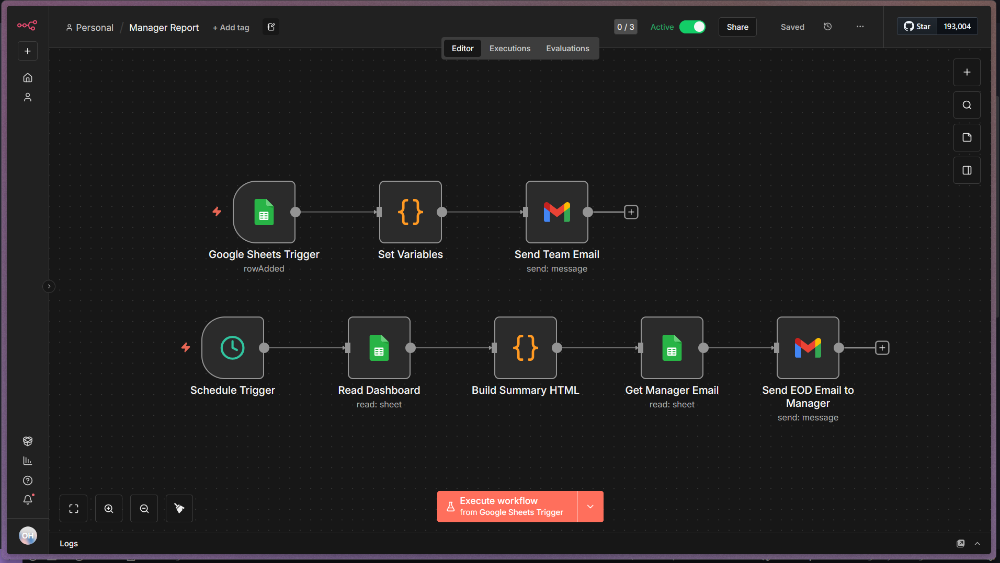

# Daily Progress Tracker (n8n + Google Forms + Google Sheets + Gmail)

A lightweight automation for small teams to track daily progress without
any paid tools. Employees check in three times a day through a Google
Form. The data lands in a Google Sheet, gets summarised automatically,
and two n8n workflows handle the notifications: one pings the whole team
on every check-in, and another sends the manager a sorted end-of-day
summary email.

## What it does

Three times a day, each employee fills out a short Google Form with
their name, time slot, current task, progress percentage, and any
blockers. Every submission appends a row to a Google Sheet, which
automatically updates a per-employee dashboard tab. As soon as someone
submits, n8n sends a notification email to the whole team so everyone
can see who has checked in. At the end of the working day, a second
workflow reads the dashboard, ranks employees by their average progress
for the day, and emails a formatted summary table to the manager.

## Workflow overview

The top row (Google Sheets Trigger, Set Variables, Send Team Email) runs
on every new form submission. The bottom row (Schedule Trigger, Read
Dashboard, Build Summary HTML, Get Manager Email, Send EOD Email to
Manager) runs once a day on a schedule.

## Repository contents

- `Daily_Progress_Tracker.json` — n8n workflow that watches for new form
  submissions and emails the team on every check-in.
- `EOD_Manager_Report.json` — n8n workflow that runs on a daily schedule
  and emails a ranked summary to the manager.
- `workflow-screenshot.png` — reference screenshot of both workflows as
  they appear in the n8n editor.

## Requirements

All tools used here are free.

- A Google account (Forms, Sheets, Gmail)
- n8n, either the free cloud trial or a self-hosted instance
- A Google Cloud project with OAuth credentials for Sheets and Gmail

## Setup

### 1. Google Form

Create a form with the following fields: a dropdown for the employee's
name, a multiple-choice question for the check-in time slot (Morning,
Midday, Evening), a short-answer question for the current task, a
linear scale (0 to 10) for progress, and an optional paragraph field for
blockers or notes. Link the form's responses to a new Google Sheet.

### 2. Google Sheet structure

The sheet needs three tabs:

`Form Responses 1` is created automatically when you link the form and
should not be edited manually.

`Dashboard` contains formulas that calculate each employee's morning,
midday, and evening progress along with a daily average. Each row should
filter results to the current date so yesterday's numbers do not carry
over.

`Config` holds settings the workflow needs, including the manager's
email address under a column header named exactly `Manager email`.

### 3. n8n credentials

In n8n, go to Settings, then Credentials, and create two OAuth2
credentials: one for Google Sheets and one for Gmail. Both can use the
same Google Cloud OAuth Client ID and Client Secret, generated from the
Google Cloud Console under APIs and Services, then Credentials. Add
every employee's email as a test user under the OAuth consent screen if
the app is still in testing mode.

### 4. Import the workflows

Import both JSON files into n8n through Workflows, then Import from
File. After importing, open each node that references Google Sheets or
Gmail and do the following:

Replace `REPLACE_WITH_YOUR_SPREADSHEET_ID` with your actual spreadsheet
ID, found in the sheet's URL between `/d/` and `/edit`.

Replace `REPLACE_WITH_EMPLOYEE_EMAILS_COMMA_SEPARATED` with your team's
actual email addresses, separated by commas.

Select your saved Google Sheets and Gmail credentials from the
credential dropdown on each relevant node.

### 5. Activate

Toggle both workflows to Active. The team notification workflow checks
for new submissions every minute. The manager report workflow runs on a
cron schedule, set by default to 5 PM on weekdays, which can be adjusted
in the Schedule Trigger node.

## Notes

The Dashboard formulas should include a date filter so that progress
from previous days does not appear as if it were submitted today. Test
each formula after setup to confirm it resets correctly at the start of
a new day.

The Gmail node used to send the team notification sends from a single
shared account regardless of who submitted the form. This is expected
behaviour, since the credential authenticates the sender, not the
person who triggered the workflow.

## License

This project is provided as-is for internal team use.
